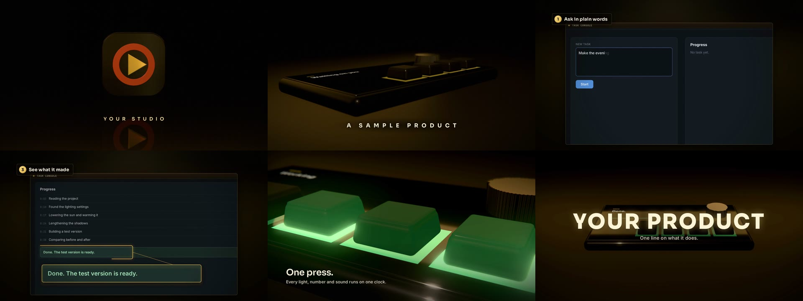

# demo-film-kit

Make demo films of any project from the real thing: trailers filmed from a game's own running build, product films of a device on a studio stage, and walkthroughs of real tools doing real work. Every picture source renders frame by frame on a locked clock, and one story file drives the cut, the captions, the score, the sound effects and the mix. One command builds the finished film: 1080p60, -16 LUFS, with an animated logo intro and a closing card.



Frames from the sample film, built from a fresh clone by `npm run build:film`.

## Picture sources

| Source | What it films | Guide |
| --- | --- | --- |
| **engine** | The game itself: a director inside the build plays a shot list while the game runs its own code (Unity director included) | [docs/ENGINE.md](docs/ENGINE.md) |
| **studio** | A three.js stage: the product modelled and lit in a dark studio, its real interface on its screens | [docs/STUDIO.md](docs/STUDIO.md) |
| **tools** | Real tools doing real work, recorded at 2x and shown in a framed window with camera moves, callout rings and loupes (web tools, terminals, Blender) | [docs/TOOLS.md](docs/TOOLS.md) |
| **ident** | Your SVG logo as an animated intro and a closing card | [docs/IDENT.md](docs/IDENT.md) |

Every source writes a take: `capture/<take>.mp4` and a manifest of the frame each shot starts on. The story (`src/timeline.js`) cuts between takes by shot name, lays captions and chapter wipes over them, and cues the score and effects on the same clock ([docs/SOUND.md](docs/SOUND.md)). [METHOD.md](METHOD.md) is how to make a film that lands: the bar, the pacing, the shape of each kind of film, and the traps.

## Requirements

- Node 20 or newer, ffmpeg with libx264 (libsvtav1 and libx265 for the web renditions), Python 3 for engine shot plans
- A Chromium for rendering: `npx playwright-core install chromium` after `npm install`, or point `CHROME` at one you have
- A GPU for the studio and the ident (WebGL); tool shots and captions render anywhere
- For engine takes: Unity 6 for the included director (tested on 6000.3 on Linux, built-in pipeline and URP; macOS should work through the same named pipe but is untested)
- For Blender shots: Blender and Xvfb, on Linux

## Try the sample

The sample film is a product demo: a device in the studio, a walkthrough of a task console filmed for real, and back to the device for the press the film builds to, between a logo intro and a closing card: 56 seconds, which takes about 20 minutes to build on a desktop GPU.

```sh
npm install
npx playwright-core install chromium
scripts/stand-in-audio.sh      # placeholder score and effects
npm run build:film             # records, renders, cuts, captions, mixes, joins and checks
```

Watch `out/film.mp4`. The build ends with each shot's worst frame-to-frame jump and a contact sheet in `out/sheets/shots.jpg`.

The trailer sample films a Unity scene: copy `unity/TrailerKit` into a Unity 6 project, choose **Tools > Trailer Kit > Build Sample Player**, point `src/timeline.js` at `./stories/trailer.js`, and run `PLAYER=<path to the built player> npm run build:film`.

## Make your film

1. Write the story: copy `src/stories/demo.js` or `src/stories/trailer.js`, and point `src/timeline.js` at it.
2. Set up the sources it needs: a director in your game, your product in `studio/scene.js`, recordings of your tools and their shots in `ui/shots.js`, your logo in `ident/`.
3. List how the picture is made in the story's `BUILD.steps`, and render stills of each source to check the framing before rendering takes.
4. Replace the stand-in audio with a real score and effects, and land the score's hit on your hero moment.
5. `npm run build:film`. After the first build, `npm run build:film -- --skip-steps` re-cuts, re-captions and re-mixes without re-rendering the takes.

## Automation

`scripts/build.mjs` runs the whole film from the story with no hand steps: it checks every sound file the story needs before rendering anything, records the tools, renders and films every take, then builds and checks the film. Each step is also a script on its own (`scripts/render.mjs`, `ui/record.mjs`, `capture/film.sh`, `scripts/overlay.mjs`, `scripts/cut.mjs`, `scripts/mix.mjs`, `scripts/join.mjs`, `scripts/check.mjs`) for working on one part at a time. [AGENTS.md](AGENTS.md) is the same workflow written as instructions for an automated agent making a film of a project end to end.

## Delivering

- **Web renditions.** `scripts/renditions.sh out/film.mp4 out/web` encodes AV1, HEVC (Main tier) and H.264 at 1080p60, H.264 at 720p60, and a WebP poster.
- **Audio description.** `node scripts/describe.mjs out/film.mp4 out/film-described.mp4` lays narrated descriptions from `DESCRIPTION` over the film's mix.
- **Re-scoring a reel.** `scripts/recut.mjs` puts a score under an existing video without touching its own sound.

### Sharing

`share/share.sh out/film.mp4 <slug> "<Title>" "<one line>"` publishes the film on a private, unguessable link: a player page with a poster and link previews, served from your computer through Tailscale Funnel by a user service that survives reboots. It probes the page, the video and the poster before printing the link. `share/share.sh --list` shows every shared film, and `--off <slug>` takes one down. Needs Tailscale with Funnel enabled and Linux user systemd.

## License

MIT, see [LICENSE](LICENSE). The fonts in `public/fonts` (Sora, Inter, JetBrains Mono) are under the SIL Open Font License, see [public/fonts/OFL.txt](public/fonts/OFL.txt).
